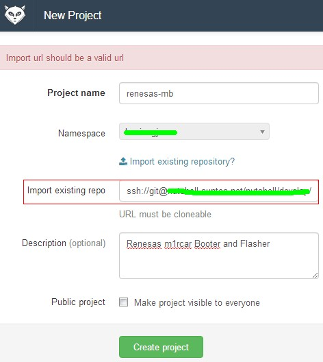
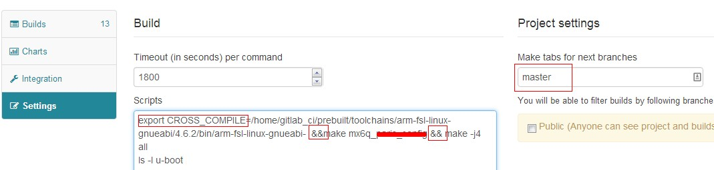
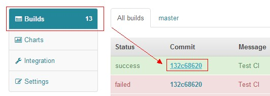
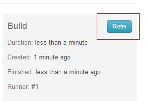
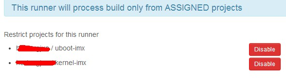

Date:2013-12-05
Title:用gitlabCI快速搭建一个GitServer与CI
Slug:用gitlabCI快速搭建一个GitServer与CI
Tags: ES

一般的公司一般都有一个或者多个中央Git Server，托管着所有项目代码；同时当一个项目很大，由许多个工程组成，例如Tizen和Android，那么一般还有Continuous Integration(CI)在有人push代码到工程时编译整个项目，编译出错一般CI会发邮件给提交者和管理者，从而可以及时修正错误。

##Git Server安装与使用
Git server很多，列举一部分：
######Windows
-	GitStack：免费版只能有两个账号
-	[SCM Manager](http://www.fishlee.net/soft/scm-manager-chs/)
######Linux
-	GitLab
-	Git-Deamon
-	Git使用-bare生成

###获取与安装
这里使用gitlab，到这里下载[bitnami gitlab一键安装包](http://bitnami.com/stack/gitlab)。安装非常简单，只需要添加可执行权限然后用sudo ./XXX.run
执行即出现图形化的安装向导。在安装过程中需要设置用户名和密码用于后面配置使用。

###gitlab的使用
直接用IP地址或者网址登陆即可。例如：`http://192.168.1.120`，要求用户名和密码时使用安装时输入的用户名和密码。

检查状态：

	$ sudo /home/git/gitlab-shell/bin/check 
	Check GitLab API access: OK
	Check directories and files: 
		/opt/gitlab-6.3.0-0/apps/gitlab/repositories: OK
		/home/git/.ssh/authorized_keys: OK
		/opt/gitlab-6.3.0-0/redis/bin/redis-cli: OK

从上面可以看到repository的位置`/opt/gitlab-6.3.0-0/apps/gitlab/repositories`。既然知道了repository在哪，那么我们就可以导入repo了。

##Repository的导入
######什么时候需要导入Repository？
以前要想sync下Android的整个代码，需要极长的时间，现在要想repo sync下Tizen的代码，在国内一般会比较困难，经常出现`unexpected hang`之类的错误，就算写个sync的脚本不断的去sync结果也很可能是好几天都无法sync成功。除此之外，我们很可能需要更改代码，而这个代码很可能并不愿意push到Tizen Gerrit去，这个时候，很可能就需要自己搭建一个本地的repository供开发人员使用。

###如何导入一个远程仓库
######第一步：在本地生成一个bare仓库
	git clone --bare PathofGitReop.git XXXX.git
参考[Pro Git](http://git-scm.com/book/zh/%E6%9C%8D%E5%8A%A1%E5%99%A8%E4%B8%8A%E7%9A%84-Git-%E5%8D%8F%E8%AE%AE)
######第二步：拷贝bare repository到gitlab的repositories中
	cp XXX.git /opt/gitlab-6.3.0-0/apps/gitlab/repositories/
######第三步：使用
	bundle exec rake gitlab:import:repos RAILS_ENV=production
参考[Gitlab Wiki](https://github.com/gitlabhq/gitlabhq/wiki/Import-existing-repositories-into-GitLab)。

另外还可以在新建project中添加：

###将repo切换到其他地方
让gitlab同步其他repository
参考stackoverflow上的[这个问题回答](http://stackoverflow.com/questions/14288288/gitlab-repository-mirroring)

#######如何导入一个本地的clone代码
有一个`.git`的git clone目录，就是一个repository，因此可以从这个repository clone代码。

	git clone user@http://IP Address/Path to the Git clone dir 
	git clone git@172.26.188.175:hexiongjun/uboot-imx.git
	git remote add origin git@172.26.188.175:hexiongjun/test.git
	git remote rm origin

####如何导入一个本地的用`git clone --mirror`产生的bare仓库
	git remote rm origin	
	git remote add origin git@IP:user/XXX.git
	git push -u origin master 
	git push -u origin otherbranch
当然也可以完全不用这么麻烦，因为.git目录就是bare repository。所以也可以直接将这个copy过去。

注意就现在这个版本（6.3.0），gitlab还不支持导入git协议的reop。
#持续集成(Continues Integration)
持续集成(△2)，是一个在有人提交文件后对整个project不断编译构建的系统。`Jenkins`是比较有名的持续集成系统，Gitlab也有一个CI。在安装的时候就默认会选择上。
在安装完成后可以进入到:`http://IP or Hostname/githubci`即可进入集成系统的管理web。
####添加权限
gitlab ci安装好后会创建一个叫做gitlab_ci的用户，ci要build gitlab中的项目第一不就是从gitlab中取一个项目，gitlab_ci用户需要有获取project的权限。将`/home/gitlab_ci/.ssh/id_rsa.pub`中的内容复制粘贴到需要被ci 添加的项目中。

####编译配置
在编译脚本中如果需要配置环境变量，那么就需要注意了，如下图，因为build scripts中的每一行都是在一个单独的sh环境中运行，因此，需要将多条命令用`&&`整合成一条。另外在侧边可以输入branch分支。

另外还有一点，在现在这个gitlabCI版本中，scripts中是不允许空行的。否则会出现`Diretory not found`的错误提示，参考[这里](https://groups.google.com/forum/#!topic/gitlabhq/RReEEyLyAGs)。
点击此页面可以跳到对应的CI中。

如果编译出错，那么还可以retry,先跳转到Builds页面：

然后再右侧有一个Retry按钮：

对应的编译log就在此页面中。而在gitlab对应的项目网页中，页面右侧将有一个build success的图片：

这个图片的连接可以在这里找到：

####新添加project到CI
在新添加任务到CI中后，需要为其分配`runner`来编译，点击下面图中Token，切换到这个runner：

然后enable刚才新添加的项目。然后再对这个runner `assign to all` 即可。

##参考：

△1：[gitlab improt repo error](https://github.com/gitlabhq/gitlabhq/issues/3424)

△2：[CI](http://en.wikipedia.org/wiki/Continuous_integration)

△3: [可以用与gitlab的表情](http://www.emoji-cheat-sheet.com/)

△4: [Bare repo释义](http://gitolite.com/concepts/bare.html)；另外比较简洁的理解参考[Pro Git](http://git-scm.com/book/zh/%E6%9C%8D%E5%8A%A1%E5%99%A8%E4%B8%8A%E7%9A%84-Git-%E5%9C%A8%E6%9C%8D%E5%8A%A1%E5%99%A8%E4%B8%8A%E9%83%A8%E7%BD%B2-Git)

△4: [bitnami](https://bitnami.com/stacks)还提供其他许多软件的一键安装包,例如LAMP RedMine等等。

##License
This blog post [is licensed under a Creative Commons Attribution-No Derivative Works 3.0 Norway License](http://creativecommons.org/licenses/by-nd/3.0/). 

